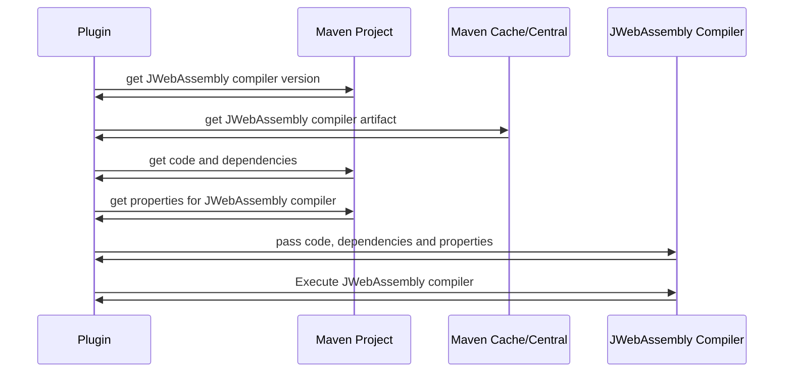

# JWebAssembly Maven Plugin
Maven Plugin (i.e., Mojo) for the [JWebAssembly compiler](https://github.com/i-net-software/JWebAssembly). Retrieves the
compiler from Maven (Central or local cache), and executes the compiler.



## Usage
The ```<configuration>``` tag can be omitted as the plugin provides defaults for all configuration options. The _goal_
to configure is _compile_.
```xml
<build>
    <plugins>
        <plugin>
            <groupId>io.schram.webassembly.maven</groupId>
            <artifactId>jwebassembly-maven</artifactId>
            <executions>
                <execution>
                    <id>java-to-wasm</id>
                    <goals>
                        <goal>compile</goal>
                    </goals>
                </execution>
            </executions>
        </plugin>
    </plugins>
</build>
```

### Output format
By default, the output format of the compiler is binary, but the compiler can also be configured to output
_WebAssembly Text (WAT)_ format.
```xml
<configuration>
    <format>text</format>
</configuration>
```

### Compiler version
By default, the plugin will use version 0.4 of the [JWebAssembly compiler](https://github.com/i-net-software/JWebAssembly)
, but this can be overridden.
```xml
<configuration>
    <compiler>
        <version>0.3</version>
    </compiler>
</configuration>
```

### Properties
Properties can be passed to the [JWebAssembly compiler](https://github.com/i-net-software/JWebAssembly)
```xml
<configuration>
    <properties>
        <IgnoreNative>true</IgnoreNative>
    </properties>
</configuration>
```